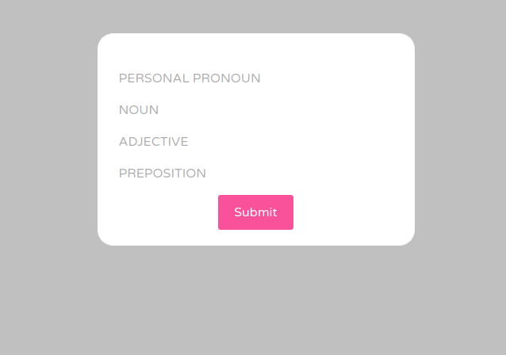

# PUBMEDLib

This is a php application that used to run on a web server that I owned.
Instead I created a Dockerfile that you can use to run it:

```bash
$ docker build -t vanessa/pubmedlib .
```

And then run the container!

```bash
$ docker run -it --rm -p 80:80 vanessa/pubmedlib
```

You can then open to [http://127.0.0.1](http://127.0.0.1) to see the interface.
It's fairly basic - you first search for a term to find an article:


And then it asks you for a series of words to fill in (akin to a Madlib)



And then it fills them into the abstract for you!


It's amazing that after all these years I could build the container around
the original code and it still seemed to work - the PubMed API is very consistent!
